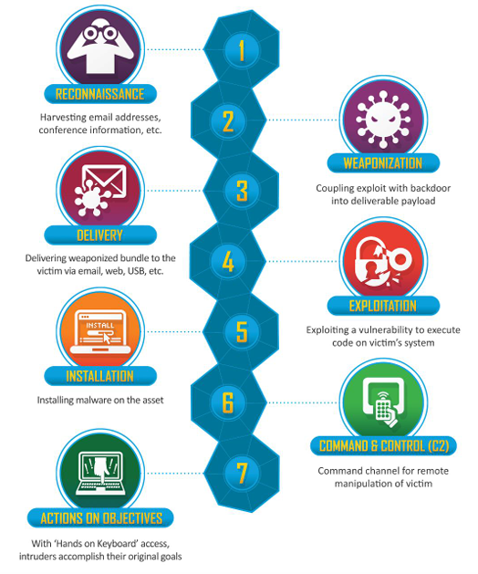

<!--
# Metadata
title: Threats & Threat Actors
author: Seb Blair (CompEng0001)
description: Lecture slides on Threats & Threat Actors
keywords: module handbook
lang: en

# Slide styling
theme: uog-theme
_class: lead title
paginate: true
_paginate: false
transition: fade 250ms

style: |
  header em { font-style: normal; view-transition-name: header; }
  header strong { font-weight: inherit; view-transition-name: header2; }
  header:not:has(em) { view-transition-name: header; }
-->

<style scoped>
h1 {
  view-transition-name: header;
  display: flex;
  align-items: center;
  margin: 0 auto;
}
</style>

# Threats & Threat Actors

<div align=center style="font-size:76px; padding-left:300px;padding-right:300px;" >

```py
module = Module(
    code="ELEE1171",
    name="Securing Technologies",
    credits=15,
    module_leader="Seb Blair BEng(H) PGCAP MIET MIHEEM FHEA"
)
```

</div>

<!-- _footer: "[Download as a PDF](https://github.com/UniOfGreenwich/ELEE1171_Lectures/raw/main/content/CommonThreatActors/CommonThreatActors.pdf)" -->

---

<style scoped>
h1 { view-transition-name: header2; }
</style>

<!-- header: "_Threats & Threat Actors_" -->

## Remember?


- Threats: 
  - Something that can cause harm to assets

<br>

- Vulnerability: 
  - a weakness or loophole that can be exploited by a threat

<br>

- Risk:
  -  Chances that something will happen OR effect of uncertainty. E.g.,
      -   Walking into a crowd during the pandemic without a face covering increases your chances (or Risk) of catching the virus.
<br>

- Impact: 
  - How much it affects our business | operations | assets

---

## What are Threats?

<br>

**Threat**
- Potential harmful events, actions, or occurrences that can exploit system vulnerabilities (computer systems, networks, applications).

- Can lead to security breaches, data loss, or damage to an organisation's assets.

- Basically, anything that has potential to cause harm to our assets.

<br>

**Threat Actor**

- Also known as malicious actors or adversaries, are individuals, groups, or entities that initiate, execute, or orchestrate the threats.

- They are responsible for activities aimed at causing harm, damage, or unauthorised access.

---

<!-- class: lead -->

# Common Threats & Threat Actors

<style scoped>
h1 { view-transition-name: header2; }
</style>

---

<!-- header: "_Threats & Threat Actors_ > **Threats**" -->


- **Malware**: Malware simply means malicious software, designed to disrupt, damage,  or gain unauthorised access to information systems and assets. Common types include viruses, worms, Trojans, ransomware, and spyware.

- **Example**: A user unknowingly downloads a malicious email attachment, infecting their computer with ransomware that encrypts valuable files until a ransom is paid.

<br>

<div>

- **Actors**: ?

- **Control**: ?

</div>

---

- **Malware**: Malware simply means malicious software, designed to disrupt, damage,  or gain unauthorised access to information systems and assets. Common types include viruses, worms, Trojans, ransomware, and spyware.

- **Example**: A user unknowingly downloads a malicious email attachment, infecting their computer with ransomware that encrypts valuable files until a ransom is paid.

<br>

- **Actors**:   Cybercriminals, hacktivists, state-sponsored attackers, or insider threats seeking financial gain, disruption, surveillance, or espionage

- **Control**: Use regularly updated antivirus/anti-malware software, apply security patches promptly, enable email filtering, implement least privilege access, and provide user awareness training on phishing and suspicious links.


---

- **Phishing Attacks**: Phishing attacks use deceptive emails, messages, or websites to trick users into revealing sensitive information, such as login credentials or financial data.

- **Example**: An attacker sends an email disguised as a legitimate bank, asking users to  update their account information by clicking a link that leads to a fake website capturing their login details.

<br>

<div>

- **Actors**: ?

- **Control**: ?

</div>


---

- **Phishing Attacks**: Phishing attacks use deceptive emails, messages, or websites to trick users into revealing sensitive information, such as login credentials or financial data.

- **Example**: An attacker sends an email disguised as a legitimate bank, asking users to  update their account information by clicking a link that leads to a fake website capturing their login details.

<br>

<div>

- **Actors**: Cybercriminals, scam operators, and occasionally state-sponsored threat actors (often leveraging social engineering techniques to exploit human error)

- **Control**: Implement email filtering and anti-spam systems, enable multi-factor authentication (MFA), provide user training to recognise phishing attempts, and deploy web filtering and domain reputation services.

</div>


---


- **Denial-of-Service (DoS) Attacks**: DoS attacks aim to overwhelm or disable a target  system or network, making it inaccessible to legitimate users by flooding it with excessive traffic or resource requests.

- **Example**: An attacker launches a DoS attack against a company's web server, causing  it to crash, and rendering the website unavailable to customers.

<br>

<div>

- **Actors**: ?

- **Control**: ?

</div>

---

- **Denial-of-Service (DoS) Attacks**: DoS attacks aim to overwhelm or disable a target  system or network, making it inaccessible to legitimate users by flooding it with excessive traffic or resource requests.

- **Example**: An attacker launches a DoS attack against a company's web server, causing  it to crash, and rendering the website unavailable to customers.

<br>

- **Actors**:  Hacktivists, cybercriminals, disgruntled insiders, or state-sponsored groups — often seeking disruption, extortion, or political impact.

- **Control**: Use network firewalls and intrusion prevention systems (IPS), deploy rate-limiting and traffic filtering, configure anti-DoS protections on routers and servers, employ cloud-based DDoS mitigation services (e.g., Cloudflare, AWS Shield), and monitor network traffic for anomalies.


---


## Distributed DOS (DDOS)


---

- **Insider Threats**: Insider threats come from within an organization and can be 
accidental or malicious. Employees or contractors may leak sensitive data or misuse 
their access privileges.

- **Example**: An employee with access to sensitive customer data leaks the information 
to a competitor for personal gain.


<br>

<div>

- **Actors**: ?

- **Control**: ?

</div>

---

- **Insider Threats**: Insider threats come from within an organization and can be 
accidental or malicious. Employees or contractors may leak sensitive data or misuse 
their access privileges.

- **Example**: An employee with access to sensitive customer data leaks the information 
to a competitor for personal gain.

<br>

- **Actors**: Current or former employees, contractors, third-party vendors, or partners — either acting maliciously (e.g., for revenge or financial gain) or negligently (e.g., through poor security practices)

- **Control**: role-based access control (RBAC), enforce the principle of least privilege, conduct regular audits and activity monitoring, deploy data loss prevention (DLP) systems, and provide security awareness training focused on internal risks.

---

- **Social Engineering**: Social engineering involves manipulating people into revealing confidential information or performing certain actions. Attackers use psychological tactics to gain trust or deceive individuals.

- **Example**: An attacker impersonates an IT technician over the phone, convincing an employee to share their login credentials, claiming it's for a system upgrade.

<br>

<div>

- **Actors**: ?

- **Control**: ?

</div>


---

- **Social Engineering**: Social engineering involves manipulating people into revealing confidential information or performing certain actions. Attackers use psychological tactics to gain trust or deceive individuals.

- **Example**: An attacker impersonates an IT technician over the phone, convincing an employee to share their login credentials, claiming it's for a system upgrade.

<br>


- **Actors**: Cybercriminals, fraudsters, disgruntled insiders, or even competitors — typically exploiting human behaviour rather than technical flaws.

- **Control**: Conduct regular staff training on social engineering awareness, establish strict identity verification protocols, use multi-factor authentication (MFA), promote a strong security culture (e.g., “trust but verify”), and implement procedures for reporting suspicious interactions.


---

<div style="font-size:22px">

- **Man-in-the-middle Attack**: attacker intercepts and potentially alters the communication between two parties who believe they are communicating directly with each other. In this type of attack, the attacker secretly positions themselves between the two parties, acting as an unauthorised intermediary. The primary goal of a man-in-the-middle attacker is to eavesdrop on the communication, manipulate it, or both, without the knowledge or consent of the legitimate parties involved.

- Example: Attackers manipulate DNS requests, redirecting users to 
malicious websites that impersonate legitimate ones.

<br>

- Actors: 

- Control: ?

</div>


---

<div style="font-size:22px">

- **Man-in-the-middle Attack**: attacker intercepts and potentially alters the communication between two parties who believe they are communicating directly with each other. In this type of attack, the attacker secretly positions themselves between the two parties, acting as an unauthorised intermediary. The primary goal of a man-in-the-middle attacker is to eavesdrop on the communication, manipulate it, or both, without the knowledge or consent of the legitimate parties involved.

- Example: Attackers manipulate DNS requests, redirecting users to 
malicious websites that impersonate legitimate ones.

<br>

- Actors: Advanced persistent threat (APT) groups, cybercriminals, state-sponsored attackers, and sometimes ethical hackers (who report the flaw responsibly).

- Control: Employ endpoint detection and response (EDR) systems, use behaviour-based intrusion detection/prevention systems (IDS/IPS), apply virtual patching where possible, keep systems up to date with the latest security updates, and adopt a zero-trust architecture to limit the spread of exploits.

</div>


---
 
- **Insider Data Theft**: This threat involves authorised individuals stealing sensitive  information for personal gain or to sell to external parties.
 
- **Example**: A disgruntled employee copies customer data, including credit card details, to sell it to a competitor.

- **Actors**: 

- **Control**: ?

---
 
- **Insider Data Theft**: This threat involves authorised individuals stealing sensitive  information for personal gain or to sell to external parties.
 
- **Example**: A disgruntled employee copies customer data, including credit card details, to sell it to a competitor.

- **Actors**:  Disgruntled employees, contractors, temporary staff, or business partners with legitimate access to internal systems or data.

- **Control**: Enforce strict access controls (least privilege), implement user activity monitoring and audit logging, use Data Loss Prevention (DLP) tools, segment sensitive data, and ensure offboarding procedures immediately revoke all access.

---

- **Advanced Persistent Threats (APTs)**: APTs are sophisticated, long-term cyber-attacks launched by skilled attackers who aim to infiltrate and remain undetected within a target organization to extract valuable information.

- **Example**: A nation-state-sponsored group infiltrates a government agency's network, gathering classified data over an extended period without being detected.

- **Actors**: 

- **Control**: ?

----

- **Advanced Persistent Threats (APTs)**: APTs are sophisticated, long-term cyber-attacks launched by skilled attackers who aim to infiltrate and remain undetected within a target organization to extract valuable information.

- **Example**: A nation-state-sponsored group infiltrates a government agency's network, gathering classified data over an extended period without being detected.

- **Actors**:  Nation-state actors, highly organised cybercriminal groups, and advanced hacker collectives targeting high-value sectors like government, defence, healthcare, or critical infrastructure.

- **Control**: Implement layered security (defence in depth), monitor networks with threat intelligence and anomaly detection, use endpoint detection and response (EDR), enforce strong authentication (MFA), conduct regular threat hunting, and apply zero-trust network principles to restrict lateral movement.

----

- **Physical Security Breaches**: Physical security breaches occur when unauthorised individuals gain physical access to information assets, such as servers or data centres.
  
- **Example**: An intruder gains access to a company's data centre and steals 
backup tapes containing sensitive customer information.

- **Actors**: 

- **Control**: ?

---

- **Physical Security Breaches**: Physical security breaches occur when unauthorised individuals gain physical access to information assets, such as servers or data centres.
  
- **Example**: An intruder gains access to a company's data centre and steals 
backup tapes containing sensitive customer information.

- **Actors**: Burglars, disgruntled employees, industrial spies, or social engineers posing as maintenance staff or delivery personnel.

- **Control**: Implement multi-factor physical access controls (e.g. keycards + biometrics), monitor with CCTV surveillance, enforce visitor sign-in and escort policies, secure equipment in locked rooms or racks, and conduct regular physical security audits.

---

## Threats

- **Supply Chain Attacks**: Supply chain attacks target vulnerabilities in the supply chain process, aiming to compromise hardware, software, or firmware before reaching end-users.

- **Example**: Attackers inject malicious code into a software update, which is then distributed to customers, infecting their systems when installed.

- **Actors**: 

- **Control**: ?

---

## Threats

- **Supply Chain Attacks**: Supply chain attacks target vulnerabilities in the supply chain process, aiming to compromise hardware, software, or firmware before reaching end-users.

- **Example**: Attackers inject malicious code into a software update, which is then distributed to customers, infecting their systems when installed.

- **Actors**: State-sponsored threat actors, organised cybercriminals, or advanced persistent threat (APT) groups — often targeting third-party vendors, developers, or logistics providers to reach the primary victim.

- **Control**: Perform thorough vetting of third-party vendors, enforce secure software development practices (e.g. code signing, SBOM), use integrity verification (hash checks), apply zero-trust principles, and monitor for anomalies in third-party systems or software updates.

---

<!-- header: "Threats & Threat Actors > Threats" -->

## Recall...

<div class="columns-2">
<div style="padding-top:150px">

- A threat needs a vulnerability
<br>
- A vulnerability is a loophole that a threat can take advantage of
<br>
- A threat would usually need a vulnerability to be successful
<br>
- It is risky to your business if you have vulnerabilities that threats can exploit

</div>
<div style="padding-top:170px">


</div>
</div>

---

<!-- class: lead -->

# Attacker’s Point of View

<style scoped>
h1 { view-transition-name: header2; }
</style>

---

<!-- header: "_Threats & Threat Actors > Threats_ > **Attacker's Point of View**" -->

<div>

## Hacking Process

</div>

<div style="padding-top:100px">


<div style="padding-top:100px">

:warning: Before this, remember ethics in relation to approval and authorisation.

---

## Cyber Kill Chain



<!-- _footer: https://www.lockheedmartin.com/en-us/capabilities/cyber/cyber-kill-chain.html -->

---

<!-- header: "Threats & Threat Actors > Threats > Attacker's Point of View" -->

## MITRE ATT&CK Framework


<!-- _footer: Visit here to explore further: [https://attack.mitre.org/](https://attack.mitre.org/) -->

---

# So How Do We Detect/Prevent?

<style scoped>
h1 { view-transition-name: header2; }
</style>

---

<!-- header: "_Threats & Threat Actors > Threats_ > **So How Do We Detect/Prevent?**" -->
<div>

## Threats

</div>

<br>

- **Anomaly-based**: establishes a baseline of normal network or system behaviour. It then identifies deviations from this baseline, flagging activities that are unusual or potentially malicious.

  - **User and Entity Behaviour Analytics (UEBA) solutions** such as Exabeam and Splunk detect anomalies in user and entity behaviour by analysing historical data to identify deviations from normal patterns.

  - **Credit Card Fraud Detection** Financial institutions use anomaly-based detection to identify unusual transactions, such as large purchases in different geographic locations, as potential credit card fraud

---

<div>

## Threat/Intrusion Detection

</div>

<br>

- **Heuristic-Based Detection**: relies on rules and algorithms to  identify potentially suspicious activities. The rules here are based on general knowledge of attack techniques rather than specific signatures.
 
  - **Email filtering systems**, like those used by Gmail and Microsoft Outlook, employ heuristics to analyse incoming emails for suspicious content, attachments, or links that may indicate phishing attempts.

  - **Web Application Firewalls (WAFs)** like ModSecurity use heuristic analysis to detect and block web application attacks based on known attack patterns

---

<div>

## Threat/Intrusion Detection

</div>

<br>

- **Behaviour-Based Detection**: Behaviour-based detection focuses on the behaviour of software or users. It monitors patterns of activities and flags deviations that indicate malicious behaviour.

  - **Endpoint Detection and Response (EDR)** solutions like CrowdStrike and Carbon Black monitor the behaviour of endpoints (e.g., computers) and alert administrators to unusual activities, such as file modifications or unauthorised access attempts.
  
  - Also used in **user authentication systems** to flag suspicious login attempts, such as multiple failed logins or login attempts from unusual locations.


---

# Security Measures


✓ Hardware

✓ Software

✓ Processes and Procedures

✓ Best Practices

<div style="padding-top:100px" align=center>

Must Know!

</div>

---

## Best Practices

- Principle of least privilege!

- Principle of need-to-know

- Defence-in-depth/Layered security

- System Hardening

- SETA Programs

- Network Segmentation

- Keeping Systems Up-to-date

- Clean Desk Policy


---

## Processes/Procedures


- Backups

- Patch and Change Management

- Vulnerability & Penetration Tests

- Continuous Monitoring

- Asset Inventory

- Secure Coding

- Input validation

- Background check/Security Clearance

- Access Control


---

## Hardware/Software


- Firewalls

- DMZ

- Intrusion Detection (Prevention) Systems {IDS/IDPS}

- Proxy/VPN Servers

- Secure Web Gateways {SWG}

- Security Information and Event Mgt {SIEM}

- Security Orchestration, Automation and Response {SOAR}

- Antivirus Program

- Data Loss Prevention Systems {DLP}


---

## Categorising Security Controls

<div style="font-size:26px">

**Categorising By Purpose,**

- Preventative: 
  - aim to stop disasters or security incidents

- Detective: 
  - uses IoCs or sensors to identify likely attacks or attempts

- Recovery: 
  - after an incident has taken place (i.e., after a successful breach or attack)

<br>

**Categorising By Mechanism & Action,**

- Technical:
  - achieved using technology

- Administrative:
  -  processes for managing/maintaining the security of technology

- Physical:
  -  physical restrictions or measures put in place to protect either technology or human assets

</div>

----

## System Hardening


---

## Access Control Types

- Mandatory Access Control (MAC)

- Discretionary Access Control (DAC)

- Role-based Access Control (RBAC)

- Rule-based Access Control (RuBAC)


---

## Conclusion

- You cannot protect against what you don’t know!

- Understanding these different types of security threats is essential for protecting information assets effectively.

- It starts with knowing what assets there are.

- By recognising potential vulnerabilities and implementing appropriate security measures, organisations can mitigate risks and safeguard their valuable data and systems