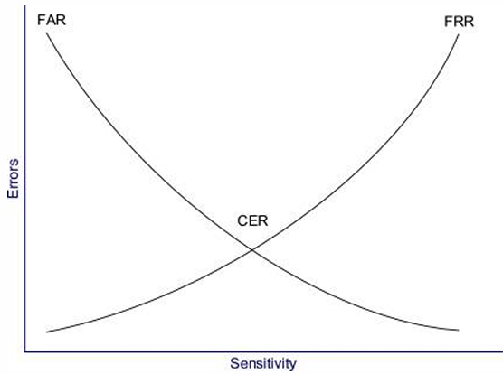
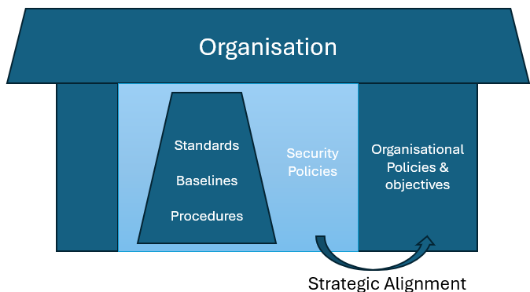
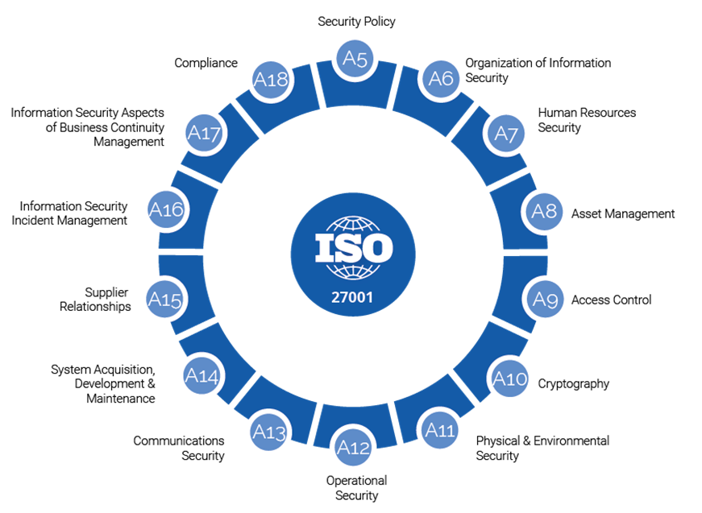

<!-- _footer: "[Download as a PDF](https://github.com/UniOfGreenwich/ELEE1171_Lectures/raw/gh-pages/content//c/Users/dev/Git/UoG/ELEE1171/Lectures/content/IAAA/IAAA.pdf)" -->

# Identification | Authentication | Authorisation | Accounting

    Module Code: ELEE1171

    Module Name: Securing Technologies

    Lecturer: Seb Blair BEng(H) PGCAP MIET MIHEEM FHEA

---

## Quick Recap

---

## Quick Recap

5 Supporting A’s

**Authentication**: verifying credentials or identity

**Accountability**: Ability to trace actions back to the source

**Auditing**: Checking for controls and compliance

**Assurance**: Confidence that systems are working as intended

**Accounting**: Property of recording every action taken by subjects on objects (logging)

---

# Identification | Authentication | Authorisation | Accounting

---

## What’s the difference

- Identity is declaring who you are

  - Username
  - Email address
  - Unambiguous or unique (especially within a domain).
  - Useful for creating audit trails. There is no accountability without identity

- Authentication is confirming who you say you are
 
  - i.e. is this claim authentic?
  - OR is it genuine?

- Authorisation talks about what you can or cannot do.

  - After gaining access
  - Privilege
  - Permissions

---

## Biometrics – Access Ctrl

The Crossover Error Rate (CER), alternatively  referred to as the Equal Error Rate (EER), signifies the juncture at which the False Reject Rate (FRR) aligns with the False Accept Rate (FAR). This metric serves as an indicator of the  comprehensive accuracy of a biometric system.

---

## Additional Resources

- [ISO 27000 Series](https://www.iso.org/standard/iso-iec-27000-family)

- [Information Security Management Principles- Andy Taylor, David Alexander, Amanda Finch and David Sutton](https://www.oreilly.com/library/view/information-security-management/9781780175201/)

- [NIST SP-800](https://www.nist.gov/itl/publications-0/nist-special-publication-800-series-general-information)

---

# Accountability | Audit | Compliance

---

## What’s they are...

- Accountability
  - You can trace actions back to source
  - Actions can be uniquely traced to the identity (username ! ID ! SSN ! NI ! Drivers license number}
  - To ensure the power given is not being abused to carry out malicious activities

- Audit
  - It’s a process of reviewing:
  - Capacity to meet initial  approval agreements as a service provider
  - Capacity to meet on-going approval agreements as a service provider
  - Checking of system records to ensure what is expected to happen has happened
  - Also used to check if nothing unusual has happened (e.g. system logs)

- Compliance
  - Meeting or exceeding expected operating procedure {Guideline | Standards | }

----

## Policies | Standards | Guidelines | Baselines

- Policy
  - High level governance document that needs to be understood by directors etc
- Standards
  - Vendor specific
- Baseline
  - Minimum Configuration
- Guidelines
  - Recommended best practices; not mandatory
- Procedures
  - Step-by-step guide

---

## Key components of Strategic Alignment

\*Major goal is the protection of the entity from harm and contributing to Organisation success.
 
Business enabler

Risk Management: Understand the risks, make decisions about them whether to accept, mitigate or change the activity

- Value delivery: ensure security delivers value

- Resource management: ensure resources are used wisely

- Performance: ensure Organisation performance is enhanced and not hindered

*When IT Security is strategically aligned, security becomes a business enabler that adds value

---

## Cyber security Policy

To provide clarity about what is expected of employees and 3rd parties when it comes to data security and use of systems and applications. That is, how they can maintain security of both data and applications.

Some important policies {could be renamed or added to as business requires}
- Acceptable Use Policy (AUP)
- Change Management Policy 
- Information Security Policy
- Business Continuity Plan (BCP)
- Disaster Recovery Policy
- Incident Response Policy (or IR Policy)
- Remote Access Policy
- Email Policy

Implementing Cyber Security Policies “provide assurance that information is being managed securely and in a consistent and corporate way” 

---

## 3 main types of Policy

1. **Regulatory**: Seeing the organisation follows standards put up by specific industry regulations

2. **Advisory**: Strongly advises employees of what behaviours and activities are allowed or prohibited according to Organisation Standard and serious consequences could follow disobedience of such.

3. **Informative**: The primary purpose of an informative policy is to educate and inform the  readers or stakeholders about a particular subject matter, procedure, or set of expectations. These policies are typically designed to be clear, concise, and easily understood by the intended audience. E.g., Privacy policy, health & safety policy, employee handbooks etc.

    

    - Health and Safety Policies: These policies detail procedures and guidelines for maintaining a safe and healthy workplace. They cover topics like emergency procedures, safety equipment usage, and accident reporting.
    - Privacy Policies: Privacy policies inform individuals about how an organisation collects, uses, stores, and protects their personal information. These policies are common on websites and apps that collect user data.
      
    

---

## Applying Security Governance Principles

- Governance: sets strategic direction and provide leadership

- Due Care: A standard of care

- Due Diligence: Continued effort

- Strategic Alignment: Supporting business objectives

- Corporate Culture: Shared attitude, vision and goals

---

## Info Security Management Systems {ISMS}

--- 

#  National and International Standards

---

## How important are standards?

- As professionals, we need to be aware of them

- We need to understand them and know which ones apply to their Organisation, Environment, etc.

- **They inform us on best practices**

- **It is important to know best practices and general principles that apply to info security**

---

## Some Important Standards to Note

- FISMA (Federal Information Security Management Act): FISMA is a U.S. federal law that mandates cybersecurity practices for federal agencies and  their contractors. It requires the development and maintenance of information security programs and compliance with NIST (National Institute of Standards and Technology) cybersecurity standards.

- SOX (Sarbanes-Oxley Act): SOX is a U.S. federal law that primarily focuses on financial reporting and disclosure. It includes provisions related to internal controls and data protection, which have implications for cybersecurity.

- GLBA (Gramm-Leach-Bliley Act): GLBA is a U.S. law that requires financial institutions to establish safeguards to protect customer information. It  addresses the security and privacy of financial data.

- HIPAA (Health Insurance Portability and Accountability Act): HIPAA is a U.S. law that governs the security and privacy of healthcare information. It  imposes stringent requirements on the protection of electronic health records (EHRs) and patient data.

- GDPR (General Data Protection Regulation): GDPR is a European Union regulation that applies to the protection of personal data. It imposes strict  requirements on how organizations handle and protect personal data of EU residents

**Key**: GLBA and Sox: Financial | FISMA: Federal agencies | GDPR & DPA: Data protection | HIPAA: Health | PCIDSS: Credit & Debit cards

---

## Some Important Standards to Note

-  DPA (Data Protection Act): The DPA is the UK's implementation of data protection laws post-Brexit, aligning with GDPR principles. It regulates the processing of personal data within the UK.

- ISO Standards (ISO 27001 and ISO 27002): ISO 27001 is an international standard for information security management systems (ISMS), while ISO 27002 provides guidelines for implementing security controls. These standards are globally recognized and widely used for cybersecurity best practices.

- NIST Cybersecurity Framework: Developed by NIST, this framework provides a risk-based approach to managing  cybersecurity risk. It offers guidelines for improving cybersecurity posture and aligning with other standards.
 
- PCI DSS (Payment Card Industry Data Security Standard): PCI DSS is a set of security standards for organizations that handle credit card transactions. It specifies requirements for securing cardholder data

Take note of the difference between ISO27001 and 27002 | Remember how they work together

---

## NIST 800-14 {Eight generally accepted system security principles}

\* Based on OECD Guidelines for Security of Info systems

1. Info/computer security supports the mission of the Organisation
2. Computer security is an integral element of sound management
3. Computer security should be cost-effective
4. System owners have security responsibilities outside their organisation
5. Computer security responsibilities and accountability should be made explicit
6. computer security requires a comprehensive and integrated approach
7. computer security should be periodically reassessed
8. Computer security is constrained by societal factors

Hint: You need to know and understand this

---

# Give an example of a perfectly secure system/location…

…to be continued | Think of the above ahead of the next class |  There might be a reward for the best answer