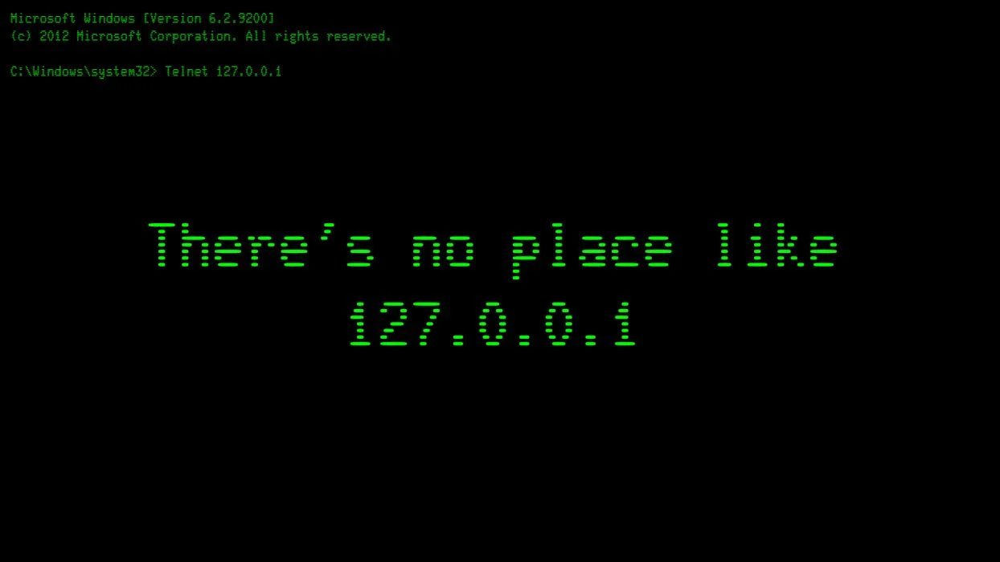

<!--
# Metadata
title: Network Security
author: Seb Blair (CompEng0001)
description: Lecture slides on Network Security
keywords: module handbook
lang: en

# Slide styling
theme: uog-theme
_class: lead title
paginate: true
_paginate: false
transition: fade 250ms

style: |
  header em { font-style: normal; view-transition-name: header; }
  header strong { font-weight: inherit; view-transition-name: header2; }
  header:not:has(em) { view-transition-name: header; }
-->

<style scoped>
h1 {
  view-transition-name: header;
  display: flex;
  align-items: center;
  margin: 0 auto;
}
</style>

# Network Security

<div align=center style="font-size:76px; padding-left:300px;padding-right:300px;" >

```py
module = Module(
    code="ELEE1171",
    name="Securing Technologies",
    credits=15,
    module_leader="Seb Blair BEng(H) PGCAP MIET MIHEEM FHEA"
)
```

</div>

<!-- _footer: "[Download as a PDF](https://github.com/UniOfGreenwich/ELEE1171_Lectures/raw/main/content/NetworkSecurity/NetworkSecurity.pdf)" -->

---

<!-- header: "_Network Security_" -->

<style scoped>
h1 { view-transition-name: header2; }
</style>

## To be Covered

<div style="font-size:30px">

- What is a Network?

- How does the Internet work?

- OSI Model and TCP/IP Model

- IP Addressing and Subnetting

- Common Network Attacks

- Wireless Vulnerability

- Benefits of wired over wireless

- How to secure your Network

- Unsecure and Secure Protocols

- Ports and Interfaces

- Bluetooth Security

</div>

---

## Quick Review – Authentication Types

<div class="columns-2" style="padding-top:150px">
<div style="padding-top:100px">

- Type 1 is the cheapest and easiest to replace 

- Type 3 is the most expensive to implement and almost impossible to replace if something happens

</div>

<div style="font-size:20px;">


</div>
</div>

---

## A Typical Network on the surface level


---

## DHCP | DNS | ARP | Firewalls | Router | Switches


---

## OSI


---

## TCP/IP

<div style="padding-top:100px;padding-left:100px;font-size:28px">

Application Layer
  - Telnet, FTP, SNMP, SMTP, DNS

Transport Layer
  - TCP, UDP
 
Internet Layer
  - IP, ICMP

Network Layer
  - Undefined in TCP/IP –Frames/MAC addresses

</div>


---

## IP

<div style="padding-top:100px;font-size:28px">

- Best effort protocol

- Logical 32-bit address

- Routing

- Performs fragmentation

- Attacks:

  -  Smurf  - ICMP attack using broadcast address

  -  Teardrop – fragmented IP packets

  -  Land – source and destination IP the same

  -  Address Spoofing – faking source address




---

## IP Fragmentation

<div style="padding-top:125px">

IP (Internet Protocol) performs fragmentation when it needs to transmit an IP packet that is larger than the Maximum Transmission Unit (MTU) of the underlying network. The MTU represents the maximum size of a packet that a particular network can handle. When an IP packet is too large to fit within the MTU of a network, IP fragmentation is used to break the packet into smaller fragments, allowing it to traverse the network and be reassembled at the destination.

</div>


---

## IP

<div style="padding-top:150px">


</div>

---

## IPv4 Address Structure

<br>
<br>

- IPv4 addresses are written as four **octets** separated by periods.
<br>
- Example: `192.168.1.1`
<br>
- Each octet is an **8-bit binary number** (total 32 bits).

  ```plaintext
  IPv4 Address Example: 11000000.10101000.00000001.00000001
  ```
<br>
- Each octet ranges from `0-255` in decimal.

---

## IPv4 Address Classes

IPv4 addresses are divided into five classes:
<br>
<br>

<div align=center>

| Class | Range                       | Usage           |Networks|Hosts|
|-------|-----------------------------|-----------------|--------|-----|
| A     | 1.0.0.0 - 126.0.0.0         | Large networks  |16777216|16777214|
| B     | 128.0.0.0 - 191.255.0.0     | Medium networks |65534|65534|
| C     | 192.0.0.0 - 223.255.255.0   | Small networks  |2097152|254|
| D     | 224.0.0.0 - 239.255.255.255 | Multicasting    |||
| E     | 240.0.0.0 - 255.255.255.255 | Experimental    |||

</div>


---

## Subnetting in IPv4

### What is Subnetting?

- Dividing a large network into smaller, manageable subnetworks.
<br>
- Uses a **subnet mask** to identify network and host portions.

### Example:

- IP: `192.168.1.0/24`
<br>
- Subnet Mask: `255.255.255.0`

  ```plaintext
  Network Portion | Host Portion
  192.168.1       | .0 - .255
  ```

---


## CIDR Notation

### CIDR (Classless Inter-Domain Routing)
- Uses `slash` notation to indicate the subnet mask length (e.g., `/24`).
<br>
- `192.168.1.0/24` means the first 24 bits are network bits.
<br>

### Examples of CIDR:
- `/8` (Class A) -> 255.0.0.0
- `/16` (Class B) -> 255.255.0.0
- `/24` (Class C) -> 255.255.255.0

---

## Example: Calculating Subnets P1

<div style="font-size:"24px">

**Given Network:** whose IP is range is `192.168.1.0/26` create four subnets.
<br>
- To create four subnets, we need to borrow bits from the host portion
   - **Subnet Mask**:
      -  `/26` -> 255.255.255.192 or `11111111.11111111.11111111.11000000`
<br>
- Calculate Number of Subnets and Hosts per Subnet:
    - With `/26`, the first 26 bits are the network portion, and the remaining 6 bits are for hosts.
    - Number of subnets created: $2^2 = 4$ (since we borrowed two bits)
    - Hosts per subnet: $2^6 = 64$ addresses per subnet (62 usable)

</div>

---
## Example: Calculating Subnets P2

3. **Determine the Subnet Ranges:**:

 - Starting with 192.168.1.0, each subnet has 64 addresses, incrementing by 64 for each subsequent subnet.

<div align=center>
<br>

|Subnet ID|	Range|	Description|
|---|---|---|
|`192.168.1.0/26 `  |	`192.168.1.0`   - `192.168.1.63`	  | First subnet
|`192.168.1.64/26`  |	`192.168.1.64`  - `192.168.1.127`	| Second subnet
|`192.168.1.128/26` |	`192.168.1.128` - `192.168.1.191` |	Third subnet
|`192.168.1.192/26`	| `192.168.1.192` - `192.168.1.255`	| Fourth subnet

</div>

---

## ICMP

<br>

Layer 3

<br>

  - Low level network diagnostics

<br>

  - PING

<br>

  - Traceroute

<br>

  - ICMP Redirec


---
## TCP

<div style="font-size:24px">

<br>

- Reliable, connection-oriented protocol
- Retransmits lost or damaged segments
- TCP header contains port and sequence numbers
<br>
- Three-way handshake
  - Syn
  - Syn/Ack
  - Ack
<br>
- Attacks
  - Session hijacking
  - Syn flood
  - Fraggle attack – UDP against broadcast address


---

<div style="padding-top:100px">


</div>

---


## UDP

<br>

Layer 4

<br>

- Connectionless

<br>

- Fast

<br>

- No security


---

## Tunnelling

- Transferring data from one network through another.

<br>

- Normally accomplished via encapsulating one networks protocols inside of another.

<br>

- Protocols include:
  - Point to Point Tunneling Protocol
  - Layer 2 Tunneling Protocol

<br>

- VPN protocols include:
 - IPSec Protocol
 - SSL/TLS

---

## Tunnelling Diagram

<div style="padding-top:100px">


</div>

---

## VPN

<div style="padding-top:100px">


</div>

---

## TOR

<div style="padding-top:100px">


</div>

---

## IPSec

- IPSec is an OSI Layer 3 protocol that can provide confidentiality and integrity checking
<br>
- IPSec is composed of three other protocols:
  - IKE– Internet Key Exchange
    - Exchanges Keys – i.e., Diffie Hellman
  - AH–Authentication Header
    - Provides **integrity** and data origin **authentication**
  - ESP–Encapsulating Security Payload
    - Primarily used for **confidentiality**

---

## IPSec

<br>

- Sets up Security Association in each direction

<br>

- Each SA is uniquely identified by:
<br>
  - An IP Destination address
<br>
  - The applicable security protocol (AH or ESP)
<br>
  - A Security Parameter Index (SPI)- a unique identifier for that connection

---

## Commonly used ports (0..65353)

<div style="font-size:28px""align=center>

|Port Number |Usage|
|----|----|
| 20         | File Transfer Protocol (FTP) Data Transfer|
| 21         | File Transfer Protocol (FTP) Command Control|
| 22         | Secure Shell (SSH)|
| 25         | Simple Mail Transfer Protocol (SMTP) E-mail Routing|
| 53         | Domain Name System (DNS) service|
| 80         | Hypertext Transfer Protocol (HTTP) used in World Wide Web|
| 110        | Post Office Protocol (POP3) used by e-mail clients to retrieve e-mail from a server|
| 119        | Network News Transfer Protocol (NNTP)|
| 123        | Network Time Protocol (NTP)|
| 143        | Internet Message Access Protocol (IMAP) Management of Digital Mail|
| 161        | Simple Network Management Protocol (SNMP)|
| 443        | HTTP Secure (HTTPS) HTTP over TLS/SSL|

</div>

----

## Network Attacks (P1)

<div style="padding-top:100px">


---

## Sniffing/Session Hijacking

<br>

- **bettercap**
  - A powerful, modular network attack and monitoring tool used for sniffing, man-in-the-middle (MITM) attacks, and session hijacking.

<br>

- **Ethercap**
  - A classic MITM attack tool capable of intercepting network traffic, performing ARP poisoning, and conducting protocol-specific attacks.

<br>

- **ARP Poisoning/ MITMF (Framework)**
  - Techniques and tools that corrupt the ARP table of a network to redirect traffic through the attacker’s device, enabling sniffing and hijacking.

---

## Detecting and Protecting against ARP Poisoning

<div style="font-size:28px">

- **Manual inspection**: Run arp -a on a system to view the current ARP table and manually compare MAC addresses with known, trusted addresses. Any suspicious or duplicated MAC entries may indicate ARP poisoning.

<br>

- **Detection tools**: Use tools like XArp or Wireshark to monitor ARP traffic on the network. XArp provides real-time ARP attack detection, while Wireshark allows you to capture and analyse ARP packets for irregular patterns or spoofed responses.

<br>

- **Network hardware controls**: Deploy switches with built-in security features such as Dynamic ARP Inspection (DAI) or port security. These switches can automatically detect and block suspicious ARP packets.

<br>

- **Static allocation**: Assign static IP and MAC address bindings on critical devices or servers. This prevents devices from relying on dynamic ARP resolution, reducing the risk of spoofed entries in the ARP table.

</div>

----

## Network Audit - Netstat

<div class="columns-2">
<div style="padding-top:100px">


<div style="font-size:19px">

```sh
netstat –t        # displays active internet connections
netstat –l        # displays listening server sockers
netstat –m        # displays masqueraded connections
netstat -a        # displays all connections and listening ports
netstat -tanp     # Show all TCP connections with numeric addresses and process IDs
```

</div>

```sh
┌──(kali㉿kali-raspberrypi)-[~]
└─$ sudo netstat -tanp
Active Internet connections (servers and established)
Proto Recv-Q Send-Q Local Address           Foreign Address         State       PID/Program name
tcp        0      0 0.0.0.0:22              0.0.0.0:*               LISTEN      678/sshd: /usr/sbin
tcp        0     36 192.168.1.169:22        192.168.1.184:4851      ESTABLISHED 2263/sshd-session:
tcp6       0      0 :::22                   :::*                    LISTEN      678/sshd: /usr/sbin
```

<div style="font-size:19px">

```sh
┌──(kali㉿kali-raspberrypi)-[~]
└─$ sudo netstat -c
Active Internet connections (w/o servers)
Proto Recv-Q Send-Q Local Address           Foreign Address         State
tcp        0     44 192.168.1.169:ssh       192.168.1.184:4851      ESTABLISHED
udp        0      0 192.168.1.169:bootpc    192.168.1.1:bootps      ESTABLISHED
Active UNIX domain sockets (w/o servers)
Proto RefCnt Flags       Type       State         I-Node   Path
unix  3      [ ]         STREAM     CONNECTED     7887     /run/user/1000/bus
unix  3      [ ]         STREAM     CONNECTED     7852     /run/user/1000/bus
unix  3      [ ]         STREAM     CONNECTED     10668
unix  3      [ ]         STREAM     CONNECTED     8063
unix  3      [ ]         DGRAM      CONNECTED     5306
```

</div>
</div>
<div>

```sh
┌──(kali㉿kali-raspberrypi)-[~]
└─$ sudo netstat -l
Active Internet connections (only servers)
Proto Recv-Q Send-Q Local Address           Foreign Address         State
tcp        0      0 0.0.0.0:ssh             0.0.0.0:*               LISTEN
tcp6       0      0 [::]:ssh                [::]:*                  LISTEN
raw6       0      0 [::]:ipv6-icmp          [::]:*                  7
Active UNIX domain sockets (only servers)
Proto RefCnt Flags       Type       State         I-Node   Path
unix  2      [ ACC ]     STREAM     LISTENING     5987     /tmp/.X11-unix/X0
unix  2      [ ACC ]     STREAM     LISTENING     7769     /tmp/.ICE-unix/914
unix  2      [ ACC ]     STREAM     LISTENING     10489    /tmp/ssh-qGHldH0NcIir/agent.1024
unix  2      [ ACC ]     STREAM     LISTENING     5302     /run/systemd/netif/io.systemd.Network
unix  2      [ ACC ]     STREAM     LISTENING     2752     /run/systemd/private
unix  2      [ ACC ]     STREAM     LISTENING     2753     /run/systemd/userdb/io.systemd.DynamicUser
unix  2      [ ACC ]     STREAM     LISTENING     2754     /run/systemd/io.systemd.ManagedOOM
unix  2      [ ACC ]     STREAM     LISTENING     10284    /run/user/1000/systemd/private
unix  2      [ ACC ]     STREAM     LISTENING     10294    /run/user/1000/bus
unix  2      [ ACC ]     STREAM     LISTENING     1155     /run/systemd/io.systemd.Credentials
unix  2      [ ACC ]     STREAM     LISTENING     10297    /run/user/1000/gnupg/S.dirmngr
unix  2      [ ACC ]     STREAM     LISTENING     10298    /run/user/1000/gcr/ssh
unix  2      [ ACC ]     STREAM     LISTENING     1645     /run/systemd/io.systemd.sysext
unix  2      [ ACC ]     STREAM     LISTENING     1158     /run/systemd/journal/stdout
unix  2      [ ACC ]     SEQPACKET  LISTENING     4121     /run/udev/control
unix  2      [ ACC ]     STREAM     LISTENING     10300    /run/user/1000/keyring/control
unix  2      [ ACC ]     STREAM     LISTENING     10301    /run/user/1000/gnupg/S.gpg-agent.browser
unix  2      [ ACC ]     STREAM     LISTENING     10302    /run/user/1000/gnupg/S.gpg-agent.extra
unix  2      [ ACC ]     STREAM     LISTENING     8335     /run/user/1000/gnupg/S.gpg-agent
unix  2      [ ACC ]     STREAM     LISTENING     8340     /run/user/1000/pulse/native
unix  2      [ ACC ]     STREAM     LISTENING     8341     /run/user/1000/pipewire-0
unix  2      [ ACC ]     STREAM     LISTENING     8342     /run/user/1000/pipewire-0-manager
unix  2      [ ACC ]     STREAM     LISTENING     9925     /run/user/1000/gnupg/S.gpg-agent.ssh
unix  2      [ ACC ]     STREAM     LISTENING     4020     /run/systemd/journal/io.systemd.journal
unix  2      [ ACC ]     STREAM     LISTENING     8455     /run/user/1000/keyring/pkcs11
unix  2      [ ACC ]     STREAM     LISTENING     7737     /run/user/1000/at-spi/bus_0
unix  2      [ ACC ]     STREAM     LISTENING     5501     /run/dbus/system_bus_socket
unix  2      [ ACC ]     STREAM     LISTENING     5502     /run/pcscd/pcscd.comm
unix  2      [ ACC ]     STREAM     LISTENING     5503     /run/ssh-unix-local/socket
unix  2      [ ACC ]     STREAM     LISTENING     5504     /run/systemd/io.systemd.Hostname
unix  2      [ ACC ]     STREAM     LISTENING     5986     @/tmp/.X11-unix/X0
unix  2      [ ACC ]     STREAM     LISTENING     7768     @/tmp/.ICE-unix/914
```

</div>
</div>

---

## DeAuth

