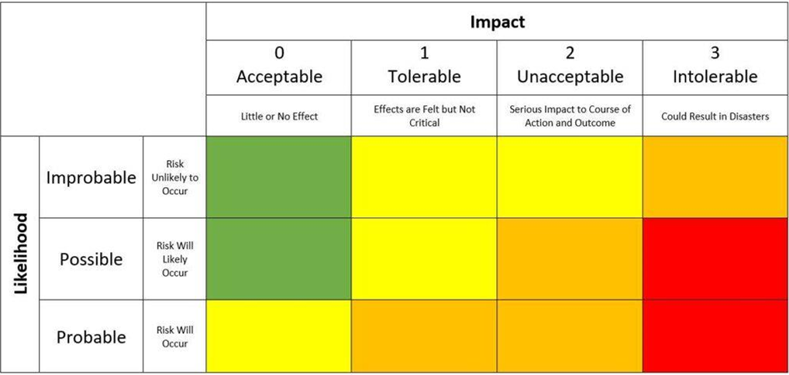
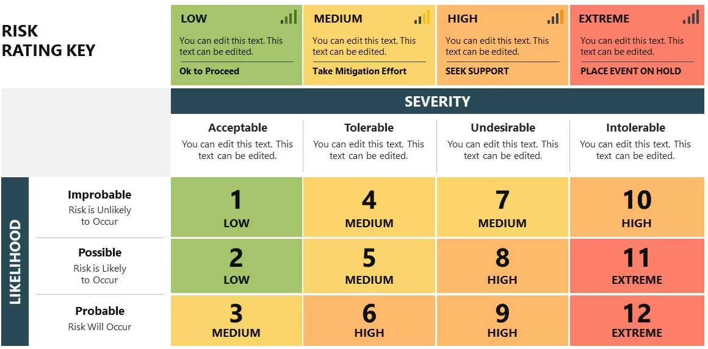

<!-- _footer: "[Download as a PDF](https://github.com/UniOfGreenwich/ELEE1171_Lectures/raw/gh-pages/content//c/Users/dev/Git/UoG/ELEE1171/Lectures/content/SecurityRisks/SecurityRisks.pdf)" -->

# Security Risks

    Module Code: ELEE1171

    Module Name: Securing Technologies

    Lecturer: Seb Blair BEng(H) PGCAP MIET MIHEEM FHEA

---

## Don't Forget

---

# Give an example of a perfectly secure system/location…

I.e., A system/location without risks | If you cannot produce any, it means there is risk in everything | So what do you do?

---

## Remember this guy?

- A threat needs a vulnerability

- A vulnerability is a loophole that a threat can take advantage of

- A threat would usually need a vulnerability to be successful
 
- It is risky to your business if you have vulnerabilities that threats can exploit!

---

## Information Risk

**4 major steps involved in Risk Assessment**

- Prepare

- Perform

- Communicate

- Maintain

**Deming Cycle**

- Plan: Identify opportunity for change

- Do: Implement change on a small scale {e.g., in a sandboxed environment | or experiment with a small group}

- Check: How does the change impact business?

- Act: Implement full change, if it goes well with business

---

## Information Assurance

The confidence that information systems will protect the information they carry and will function as they need to, when they need to, under control of legitimate users.

(UK Cabinet office, as cited in Information Security Mgt. Principles- 3rd edition)

Information Security: Preserving CIA | And supporting with the 5 A’s

---

## Risk Assessment

- Cost and Benefit are major considerations in Risk Assessment.

- If the Cost is more than the benefit, it is not worth it.

- If the Benefit is greater than the cost, then we do it

Cost could be in terms of:

- impact on business processes

- financial implication

- impact on lives | the Society

- impact on assets etc.

i.e., what price would we have to pay?

---

## Risk Assessment

 **Quantitative,**

 - $SLE\ = SLE\ \cdot\ ARO$
 
 - $SLE\ = AV\ \cdot\ E.F$
 
 - $E.F\ = \frac{\text{Value of asset lost}}{\text{Total value of asset}}$

 - $ARO\ = \frac{\text{No. of occurrences in a year}}{\text{Total time period}}$

**Qualitative,**

 - Risk matrix
 - A good standard to follow for this is the ISO27005

*Quantitative deals with numbers | Qualitative qualifies the risks using adjectival and/or adverbial phrases e.g., very likely

---

## Quantitative

- $AV$ = total value of the asset that could be affected by a particular risk

- $SLE$ = estimated financial loss resulting from a single occurrence of a specific risk or 
threat

- $ARO$ = quantifies how frequently a specific risk or threat is expected to occur within 
a year

- $E.F$ = expressed as a decimal or percentage, represents the proportion of the asset's value that would be lost in the event of a security incident

- $ALE$ = estimate the expected financial loss from specific risks over a year

---

## Quantitative

**Example 1**

You are managing a small business with an inventory system. The Asset Value ($AV$) of your inventory is £20,000, and the Exposure Factor ($E.F$) for the risk of inventory loss is 15%. The Annualised Rate of Occurrence ($ARO$) for this risk is 0.05, indicating that the threat occurs five times a year.

- $ALE\ = SLE\ \cdot\ ARO$

- $SLE\ = AV\ \cdot\ E.F$

- $E.F\ = \frac{\text{Value of asset lost}}{\text{Total value of asset}}$

- $ARO\ = \frac{\text{No. of occurrences in a year}}{\text{Total time period}}$

- **Take note,**
   - To get the ALE, we need the SLE and ARO
   - ARO is provided but we need to find SLE

---

## Quantitative

**Example 1 - Solution**

You are managing a small business with an inventory system. The Asset Value ($AV$) of your inventory is £20,000, and the Exposure Factor ($E.F$) for the risk of inventory loss is 15%. The Annualised Rate of Occurrence ($ARO$) for this risk is 0.05, indicating that the threat occurs five times a year.

- $SLE\ = AV\ \cdot\ E.F$

  $£3000\ =\ £20000 \cdot 0.15$

- $ALE\ = SLE\ \cdot\ ARO$

  $£150\ =\ £3000 \cdot 0.05$

--- 

## Quantitative

**Example 2**

You are an IT security manager for a company, and you are assessing the risk associated with phishing attacks targeting your employees. Your analysis shows that, on average, your company experiences 12 phishing incidents per year. Calculate the ARO for phishing attacks over a period of 5 years

- $ARO\ = \frac{\text{No. of occurrences in a year}}{\text{Total time period}}$

- **In this case,**
  - No. of occurrences in a year = 12 
  - Total time period = 5 years
  - ARO = 12 / 5 = 2.4

---

## Quantitative

**Organisations use ALE to:**

- Prioritise Risks: ALE allows organisations to rank risks based on potential financial impact. High ALE 
values indicate risks that require immediate attention.

- Allocate Resources: ALE helps in allocating resources efficiently. Risks with higher ALE values may 
receive more budget for security measures.

- Risk Mitigation: ALE guides organisations in determining the most cost-effective security measures 
to mitigate risks with high ALE values.
 
- Security Investments: ALE supports decisions on investing in cybersecurity solutions and insurance 
based on the financial consequences of risks.

- Compliance Requirements: ALE assists in understanding the financial implications of failing to meet 
compliance requirements, influencing decisions on compliance investments.

---

## Qualitative

---

## Qualitative (Weighted)

---

## Risk Management Strategies

**After risk is discovered/assessed, there is a need to apply a management strategy:**

- Risk Avoidance

- Risk Mitigation

- Risk Transference/sharing

- Risk Acceptance