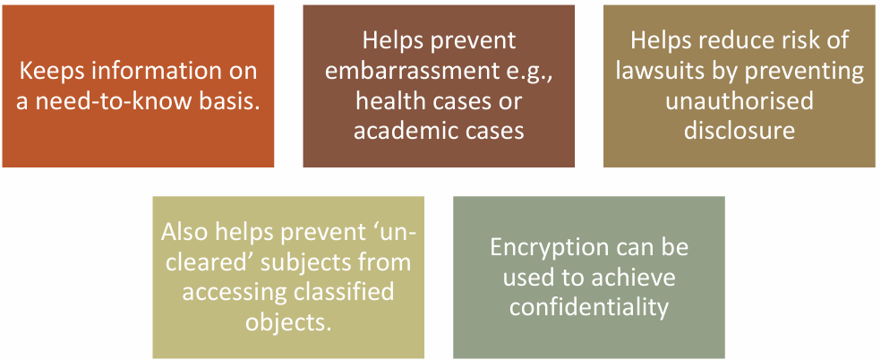

<!-- _footer: "[Download as a PDF](https://github.com/UniOfGreenwich/ELEE1171_Lectures/raw/gh-pages/content//c/Users/dev/Git/UoG/ELEE1171/Lectures/content/WhatIsSecurity/WhatIsSecurity.pdf)" -->

# What Is Security

    Module Code: ELEE1171

    Module Name: Securing Technologies

    Lecturer: Seb Blair BEng(H) PGCAP MIET MIHEEM FHEA

---

## Some Terms to Note


- 2FA – Two-factor Authentication

- ACL – Access control list

- BIA – Business Impact Analysis

- 5G – Fifth generation cellular network telephony

- BCP – Business Continuity Plan

- CC – Common Criteria

- CCTV – Close Circuit Television

- CERT – Computer Emergency Response Team

----


## Content


- What is security

- CIA

- Threats | Risks | Vulnerabilities

- Encryption

- Privacy

- GDPR

- BCP | IRP | CP

- What is management?

- Do I need to be technical for Cybersecurity?

----

## What is Security?

**Introduction**

<div style="font-size:24px">

Two main objectives of Security:

- Making sure authorised personnel have access to the resources they need

- Making sure unauthorised personnel do not have access to the resources

- Authentication is the procedure of confirming the identity of the user trying  to access certain data

- It is a mandatory element of security model

</div>


---

## What are we protecting?

<div style="font-size:24px">

Assets: Anything __of value__ to your Organisation

- Hardware

- Software

- Staff

- Data

- Network
 
Lives: This is because Cyber Security involves protecting beyond your Organisation. E.g. Citizens of a Country, customers, children etc.

</div>


---

## What are we protecting?

**Asset types**

 ▪Physical Assets: know any?

 ▪Pure information/Data

 ▪Software: for managing or processing information

---

## What are we protecting from?

- Threats: Something that can cause harm to assets

- Vulnerability: a weakness or loophole that can be exploited by a  threat

- Risk: Chances that something will happen OR effect of  uncertainty. E.g. Walking into a crowd during the pandemic without a face covering increases your chances (or Risk) of catching the virus. Wearing a mask also does not totally eradicate it but mitigates the chances.

- Impact: How much it affects our **business** | **operations** | **assets**

---

## Bringing all together;

- A threat needs a vulnerability

- A vulnerability is a loophole that a threat can take advantage of

- A threat would usually need a vulnerability to be successful

- It is risky to your business if you have vulnerabilities that threats can exploit


---

## Main Goals of Security

<div style="font-size:26px">

**Confidentiality**: Only authorised subjects can view or access information. If you are not authorised, no access. If you do not have clearance, no access.

**Integrity**: Information is not modified illegally or by an unauthorised subject.  Can also mean a system is working as it is supposed to. E.g. patient monitor at hospitals. {Accuracy and completeness}.

**Availability**: System is available when needed or queried. That is, it responds  when it is expected to. Availability can affect both data and system. E.g. Ransomware

**Strategic alignment**: All the above need to work together towards achieving the Company’s goals


---

## Information Security Principles

- DAD Acronym {Opposite of the CIA}
 - Disclosure:
 - Alteration:
 - Destruction/Denial:


---

## Why is confidentiality important?



---

## Subject vs Object

-  Subject: makes request to access/use an object

    `curl -S https://path/to/url --data $(cat)`


-  Objects: the resource a subject needs access to
   ```json
    {
      "id": 1001,
      "title": "What is JSON?",
      "author": {
      "name": "James Walker"
      },
      "tags": ["api", "json", "programming"],
      "published": false,
      "publishedTimestamp": null
    }
   ```

---

## Importance of Integrity

Helps ensure information is unchanged between source and destination

Hashing can be used to easily compare files and spot those that have been altered (by comparing their hashes)

```sh
Your Hash: 109e5b8ae6b96f16a7fbd7e774a011ce
Your String: "This MD5 has generator is useful for enconding passwords,"

Your Hash: ec490bd8facf2e56af2cd82274ef56f3
Your String: "This MD5 has generator is useful for enconding passwords"
```

----

## Practical- How to check for file Integrity

**Windows**

```sh
certutil   –hashfile    <filename>    <md5, sha1, sha256, sha512>    [ENTER]
```

**Linux/Mac**

```sh
<md5sum, sha1sum, sha256sum. sha512sum>   <filename>  [ENTER]
```

<div style="font-size:20px; padding-top:100px">

\* The major difference between Hashing and Encryption is that: No keys are used in hashing but only algorithms e.g., MD5

</div>

---

## Why is availability important?

- Using an e-commerce site for example

- Customers should always be able to buy. If the site is not reachable, no sales,  and if no sales, no profit.Continuous lack of profit = loss of business

- Not being reachable could also affect the business’s reputation and furthermore push customers to competitors.


<div style="font-size:20px; padding-top:100px">

| \*Information that is not available when and as required is not information  at all but irrelevant data |

</div>

----

## The Security and Operational Triad


----

## Information Security Principles

5 Supporting A’s

**Authentication**: verifying credentials or identity

**Accountability**: Ability to trace actions back to the source

**Auditing**: Checking for controls and compliance

**Assurance**: Confidence that systems are working as intended

**Accounting**: Property of recording every action taken by subjects on objects (logging)

